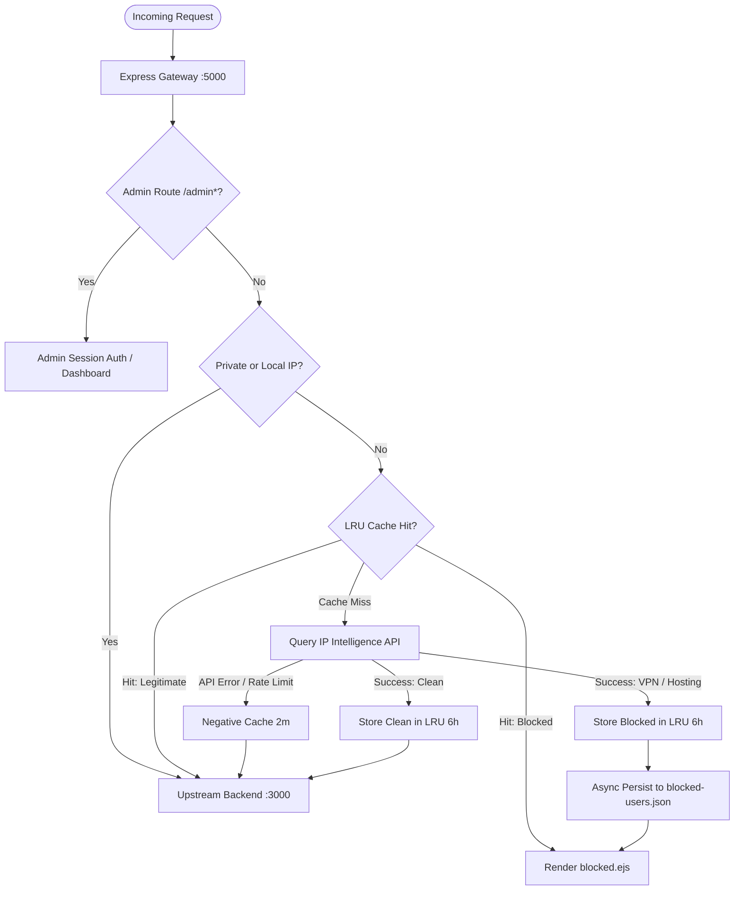

# 🛡️ VPN Security Gateway

[](https://nodejs.org/)
[](https://expressjs.com/)
[](https://opensource.org/licenses/ISC)
[](test_verify.js)

**VPN Security Gateway** is a high-performance, reverse-proxy firewall built for Node.js web applications. It intercepts incoming HTTP traffic, detects and blocks connections originating from commercial VPNs, datacenters, Tor, and open proxies, while seamlessly forwarding legitimate visitors to your backend application.

Built with an **in-memory LRU cache**, **asynchronous non-blocking persistence**, and **HMAC-signed session authentication**, it delivers enterprise-grade protection without degrading upstream latency or hitting external API rate limits.

---

## 📑 Table of Contents

- [Key Features](#-key-features)
- [How It Works](#-how-it-works)
- [Architecture & Request Flow](#-architecture--request-flow)
- [Quick Start](#-quick-start)
- [Configuration](#-configuration)
- [Admin Dashboard](#-admin-dashboard)
- [Security Hardening](#-security-hardening)
- [Testing](#-testing)
- [API & Route Reference](#-api--route-reference)
- [Production Deployment](#-production-deployment)
- [License](#-license)

---

## ✨ Key Features

- **🚀 Sub-Millisecond LRU Caching**: Integrated `lru-cache` (10,000 IPs, 6-hour TTL) caches IP reputation decisions in memory. Repeat requests from known IPs are evaluated instantly with zero external network overhead.
- **⚡ Negative Caching (Anti-Hammering)**: Transient API rate limits or network hiccups are negatively cached (2-minute TTL) to prevent API bans and eliminate thundering herds.
- **🏠 Automatic Private / Loopback Bypass**: Automatically detects loopback (`127.0.0.1`, `::1`) and RFC1918 private subnets (`10.x`, `172.16-31.x`, `192.168.x`), preventing redundant lookups during local development or microservice-to-microservice traffic.
- **🔒 Hardened Admin Authentication**: Eliminates insecure query-string passwords. Authentication uses cryptographically signed, HTTP-only, `SameSite=Lax` session cookies powered by SHA-256 HMAC tokens.
- **🔄 Transparent Reverse Proxy**: Legitimate visitors are transparently proxied to your upstream backend application via `http-proxy-middleware`, preserving headers and streaming responses.
- **📊 Real-Time Admin Dashboard**: Monitor blocked traffic in real time, view geographic metrics, track LRU cache efficiency (hits, misses, and hit rate %), and purge the IP cache with one click.
- **💾 Thread-Safe Asynchronous I/O**: High-concurrency queue serialization prevents race conditions and ensures file writes never block the Node.js event loop.

---

## 🔍 How It Works

1. **Traffic Interception**: Every incoming HTTP request enters the gateway.
2. **Path & Subnet Check**: Requests to `/admin*` routes and private/internal IP ranges bypass external inspection.
3. **Cache Lookup**: The gateway queries the in-memory LRU cache for the client IP.
   - **Cache Hit (Clean)**: Request is instantly forwarded to `TARGET_APP`.
   - **Cache Hit (VPN/Proxy)**: Request is halted and served a customized frosted-glass "Access Blocked" page.
4. **IP Intelligence**: If the IP is not in cache, the gateway queries IP threat intelligence to check `proxy` and `hosting` flags.
5. **Decision & Logging**:
   - Clean IPs are marked safe and saved to the LRU cache.
   - Suspicious IPs are recorded asynchronously to `blocked-users.json` and `vpn-log.txt`, cached in memory as blocked, and served the blocked landing page.

---

## 📐 Architecture & Request Flow



---

## 🚀 Quick Start

### 1. Prerequisites
- **Node.js**: `v20.0.0` or higher
- **npm**: `v9.0.0` or higher

### 2. Installation
Clone the repository and install dependencies:
```bash
git clone https://github.com/Samaruta-batto/VPN_Security_Gateway.git
cd VPN_Security_Gateway
npm install
```

### 3. Configure Environment Variables
Set your custom admin password and backend application URL:
```bash
# Linux / macOS
export ADMIN_PASSWORD="your-strong-password"
export TARGET_APP="http://localhost:3000"
export PORT=5000

# Windows (PowerShell)
$env:ADMIN_PASSWORD="your-strong-password"
$env:TARGET_APP="http://localhost:3000"
$env:PORT=5000
```

### 4. Start the Gateway
```bash
npm start
```
The gateway will launch on `http://0.0.0.0:5000`.

### 5. Access the Admin Dashboard
1. Open your browser and navigate to `http://localhost:5000/admin-login`.
2. Enter your `ADMIN_PASSWORD` (default: `admin123`).
3. View real-time security statistics, blocked IP histories, and cache hit metrics.

---

## 🔧 Configuration

All settings are controlled via environment variables:

| Variable | Description | Default | Security Recommendation |
|:---|:---|:---:|:---|
| `PORT` | Port the security gateway listens on | `5000` | Bind behind your public edge or reverse proxy. |
| `TARGET_APP` | Upstream backend application to protect | `http://localhost:3000` | Ensure the backend is not directly exposed to the public internet. |
| `ADMIN_PASSWORD` | Password for the `/admin` dashboard | `admin123` | **Must change in production!** |
| `SESSION_SECRET` | Secret key used to sign session cookies | Auto-generated random string | Set a persistent 32+ character secret across restarts. |

---

## 📊 Admin Dashboard

The built-in administration panel (`/admin`) provides visibility into blocked traffic and gateway health:

- **Total Blocked Counter**: Total number of unique blocked connection attempts logged.
- **24-Hour Activity Window**: Real-time count of blocked attempts over the past 24 hours.
- **Geographic Distribution**: Unique countries represented by blocked requests.
- **LRU Cache Performance**: Real-time IP cache entries, hit/miss counter, and live hit rate percentage.
- **Cache Management**: One-click **🧹 Clear LRU Cache** button to immediately flush all cached IP reputations.
- **Detailed Threat Table**: Detailed logs including timestamp, IPv4, IPv6, Country, City, ISP, and Organization.

---

## 🔒 Security Hardening

- **Session Cookie Security**: Uses HTTP-only, `SameSite=Lax` cookies with SHA-256 HMAC token validation. Session tokens cannot be accessed via JavaScript (`XSS-safe`) and are never exposed in URL query parameters.
- **Zero Cleartext Credential Leaks**: Credentials are removed from logs; warning notifications trigger only when default credentials remain active.
- **Proxy Header Trust**: Configured with Express `trust proxy` enabled to resolve authentic client IPs through cloud load balancers (AWS ALB, Cloudflare, Nginx).
- **Asynchronous Disk Queue**: Writing to disk uses an asynchronous queue (`fs.promises.writeFile`), preventing concurrent write corruption and eliminating Event Loop blockage.

---

## 🧪 Testing

The repository includes an automated integration test suite that verifies IP detection, LRU caching, auth tokens, and HTTP endpoint workflows:

```bash
npm test
```

Expected output:
```
--- Starting VPN Gateway & LRU Cache Tests ---
Testing isPrivateOrLocalIP...
✓ isPrivateOrLocalIP tests passed
Testing LRU Cache...
✓ LRU Cache operations passed
Testing Auth Tokens...
✓ Auth Token tests passed
Testing HTTP Endpoints...
✓ All HTTP endpoint and LRU Cache integration tests passed!
--- ALL TESTS PASSED SUCCESSFULLY ---
```

---

## 🛣️ API & Route Reference

| Method | Endpoint | Description | Access |
|:---|:---|:---|:---|
| `GET` | `/` | Main gateway proxy entry point. Evaluates IP and proxies clean traffic. | Public |
| `GET` | `/admin-login` | Admin login page. | Public |
| `POST` | `/admin-login` | Authenticates admin credentials and issues session cookie. | Public |
| `GET` | `/admin-logout` | Clears admin session cookie and redirects to login. | Public |
| `GET` | `/admin` | Administration dashboard and threat log viewer. | Authenticated |
| `POST` | `/admin/clear-cache` | Flushes all entries from in-memory LRU cache. | Authenticated |
| `ALL` | `/*` | Any route not handled by admin is checked and forwarded to `TARGET_APP`. | Evaluated |

---

## 🚢 Production Deployment

### Recommended Setup: Reverse Proxy Architecture
In production, place this gateway between your edge balancer and your backend application:

```
Internet ──► [Edge / Cloudflare / Nginx (Port 443)] 
                   │
                   ▼
         [VPN Security Gateway (Port 5000)]
                   │ (If Clean)
                   ▼
         [Internal App Server (Port 3000)]
```

### Running with PM2
```bash
npm install -g pm2
pm2 start index.js --name "vpn-gateway" -i max
pm2 save
```

### Systemd Service File (`/etc/systemd/system/vpn-gateway.service`)
```ini
[Unit]
Description=VPN Security Gateway
After=network.target

[Service]
Type=simple
User=node
WorkingDirectory=/opt/vpn-gateway
Environment=PORT=5000
Environment=TARGET_APP=http://127.0.0.1:3000
Environment=ADMIN_PASSWORD=change_this_to_a_secure_password
Environment=SESSION_SECRET=super_secret_session_key_32_characters
ExecStart=/usr/bin/node /opt/vpn-gateway/index.js
Restart=always
RestartSec=5

[Install]
WantedBy=multi-user.target
```

---

## 📄 License

This project is licensed under the [ISC License](LICENSE).
